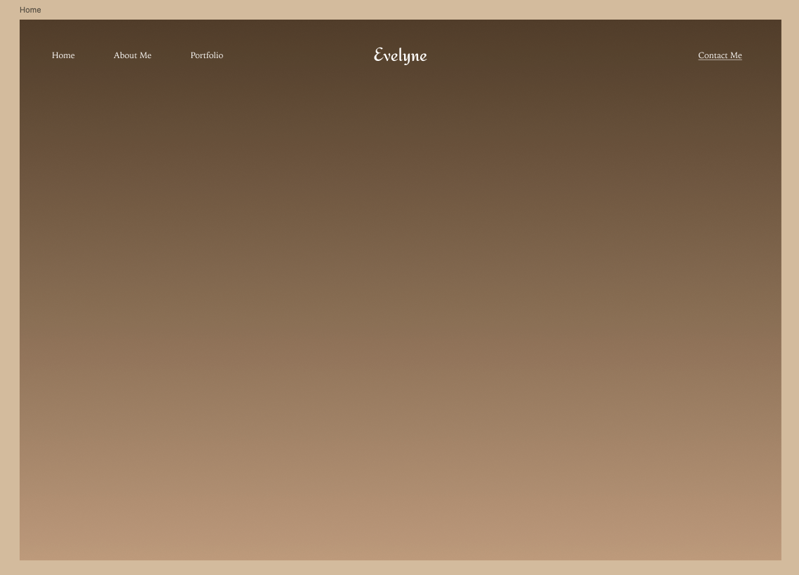
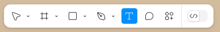
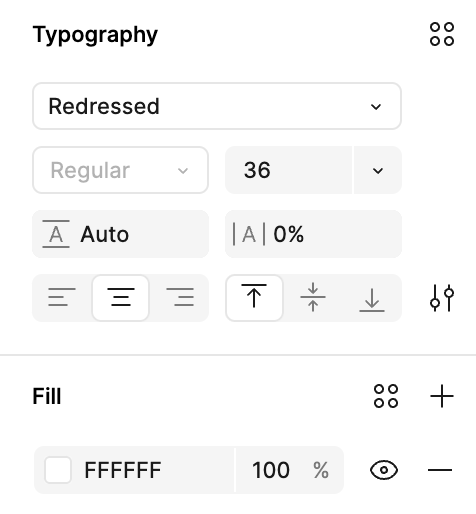
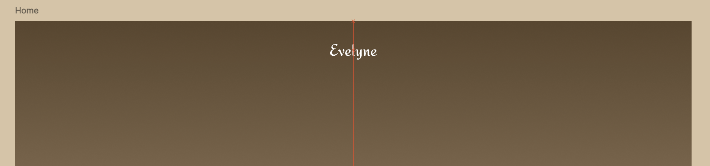
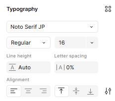
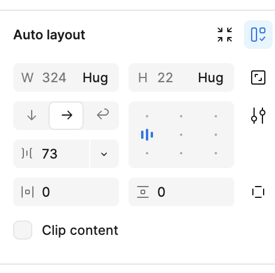
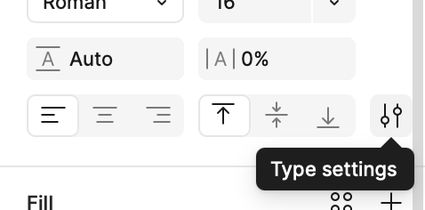
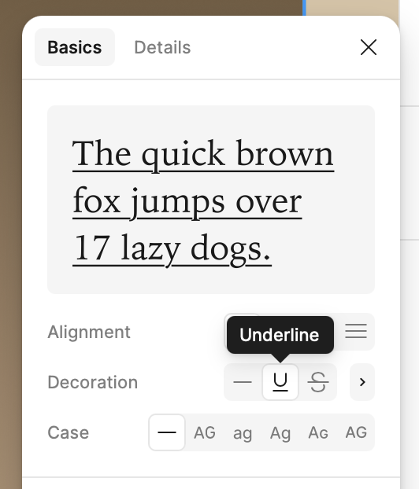

### Section Preview  

Before you begin, take a look at the **final result** you’ll be working towards in this section:  

  

---

# Building the Header  

>**💡 Hint:** If you need to zoom in while working in Figma, use **Command +** (for Mac) or **Ctrl +** (for Windows). And to zoom out use **Command -** (for Mac) or **Ctrl -** (for Windows). This makes it easy to navigate and focus on details in your design!

## 1. Creating the Logo  

The logo will be a **text-based brand name** positioned at the center of the header. Follow these steps:  

1. Select the **"Home" Frame** in the **Layers Panel** to ensure you are working within the correct space.  
2. On your keyboard, press **T** to activate the **Text Tool**, or click the **Text** icon in the bottom toolbar.  
  
3. Click anywhere near the **top center** of the frame and type: **"Evelyne"** (or customize by using your own first name).  
4. In the **Layers Panel**, click on the new text layer to ensure it's fully selected.  
5. In the **Right Sidebar**, set the following properties:  
   - **Font Family:** Redressed  
   - **Font Size:** 36  
   - **Text Alignment:** Center
   - Make sure the colour is selected to white FFFF: F0F0F0
  

    <button onclick="toggle('gif1')">Show/Hide Animation</button>
    

    
    

6. Click and **drag the text** to the center of the frame.  
   - To make sure it’s perfectly centered, look for the **alignment guides** (red lines).  
   - Position it **close to the top of the frame** but **leave enough space** for a balanced layout.  
  

## 2. Adding the Left-Side Navigation  

Next, we’ll add text links on the left side of the header.  

1. On your keyboard, press **T** to activate the **Text Tool**, or click the **Text** icon in the bottom toolbar.  
2. Click on any spot close to the top left of the frame and type **"Home"**  
3. In the **Layers Panel**, ensure the text layer is selected.  
4. In the **Right Sidebar**, set the following properties:  
   - **Font Family:** Noto Serif JP  
   - **Font Size:** 16  
   - **Font Style:** Regular *(this is selected via the dropdown to the left of the font size input)*  
   - **Text Alignment:** Left  
  
5. Repeat the  steps to create two more text layers for **"About Me"** and **"Portfolio"**.  
6. Drag and position the **text layers** side by side in a horizontal row.  
7. Hold down the **Shift key** and click on each of the three text layers (**Home**, **About Me**, and **Portfolio**) to select them all.  
8. Release the **Shift key** while keeping the text layers selected. **Right-click** on the selection and choose **Add Auto Layout** from the list (Shortcut: Press **Shift + A**).  
   - The text items should now be evenly spaced horizontally.  
   - In the **Layers Panel**, you’ll see that Figma has placed them inside a new **Auto Layout frame**.  
   - Auto Layout automatically organizes elements within a frame, making it easier to adjust spacing and maintain alignment dynamically. 
9. In the **Layers Panel**, select your newly created **Auto Layout frame**. Then, in the **Right Sidebar**, under **Auto layout**, change the value of the horizontal spacing to **73** to ensure enough spacing between the navigation links.  
  

    <button onclick="toggle('gif2')">Show/Hide Animation</button>
    

    
    

## 3. Adding the "Contact Me" Link  

Now that the navigation links are properly aligned and spaced, we'll move on to designing the **"Contact Me"** link.

1. On your keyboard, press **T** to create a new text layer and type: **"Contact Me"**  

2. In the **Right Sidebar**, set the following properties:  
   - **Font Family:** Noto Serif JP  
   - **Font Size:** 16  
   - **Font Style:** Regular  
   - **Text Alignment:** Right  

3. To add an **underline**, follow these steps:  
   - In the **Right Sidebar**, click on **Type settings** (it should have the icon as shown below).  
  
   - Click on the Underline icon to apply it.  
  

4. Drag the **"Contact Me"** text to the **top right** corner of the header.  

    <button onclick="toggle('gif3')">Show/Hide Animation</button>
    

    
    

## 4. Aligning and Grouping the Header Elements  

Now that all elements are in place, let's make sure they are perfectly aligned and grouped together.  

1. Click and drag around each of the elements to adjust them until everything is properly centered and spaced.  
2. Now select all elements inside the **Home Frame** by clicking and dragging over them. Then, **right-click** on the selection and choose **Group Selection** from the menu. This will combine all elements into a single group, making it easier to move and manage them as one unit. 
  
3. In the **Layers Panel**, rename the group to **"Header"** for better organization.  

Now that the header is complete, let’s move on to **designing the rest of the home page**, including images, and buttons.  

[NEXT STEP: Designing the Home Page](home-page.html){: .btn .btn-blue }  
