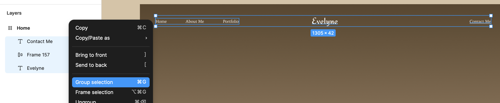

### Section Preview

Before we begin, look at what we are building. A header isn't just text floating in space—it is a **container** that holds navigation.

---

# Building the Header (The Right Way)

> **💡 Figma Mindset:** In other tools, you group things. In Figma, we **Frame** things. A Frame is like a smart container that keeps your design organized and allows you to add background colors easily.

## 1. Create the Header Container
Instead of typing text directly on the blank page, we will first create the "strip" that holds our header.

1.  Press **F** on your keyboard (Frame tool).
2.  Draw a wide rectangle at the top of your **"Home"** frame.
3.  In the **Right Sidebar**, set the size manually to ensure it fits perfectly:
    * **W (Width):** 1440
    * **H (Height):** 100
4.  Rename this frame **"Header Container"** in the Layers Panel.

## 2. The Logo
Now, place your brand inside this new container.

1.  Select your new **"Header Container"**.
2.  Press **T** (Text) and click inside the center of the container.
3.  Type: **"Evelyne"** (or your name).
4.  **Style it:**
    * **Font:** Redressed
    * **Size:** 36
    * **Align:** Center
    * **Color:** Dark Grey or Black (#333333)
5.  **Perfect Centering:** Don't drag it! With the text selected, look at the very top of the Right Sidebar and click **Align Horizontal Centers** and **Align Vertical Centers** (the icons look like centered lines).
    * *Now your logo is mathematically perfect.*

## 3. The Navigation Links (Auto Layout)
We want our menu links to stay evenly spaced, even if we change the words later. We use **Auto Layout** for this.

1.  Press **T** and type **"Home"**.
2.  **Style it:** Noto Serif JP, Size 16.
3.  Duplicate this text twice (Ctrl+D or Cmd+D) to create **"About Me"** and **"Portfolio"**.
4.  **The Magic Step:**
    * Select all three text layers (Hold Shift + Click).
    * Press **Shift + A** (or right-click > Add Auto Layout).
    * *Boom! They are now locked in a smart row.*
5.  **Adjust Spacing:**
    * With the new Auto Layout frame selected, go to the Right Sidebar.
    * Find the **Gap between items** box (it looks like horizontal lines) and type **50**.
6.  Drag this menu to the **left side** of your Header Container.

<button onclick="toggle('gif2')">Show/Hide Animation</button>

## 4. The "Contact" Link
1.  Press **T** and type **"Contact Me"**.
2.  **Style it:** Same font as before (Noto Serif JP, 16).
3.  **Add the Underline:**
    * Click the **3 dots (...)** in the Text section of the sidebar.
    * Select the **Underline** icon (Concept: Decoration).
4.  Move this to the **far right** of your Header Container.

## 5. Final Alignment & Constraints
This is the step that separates beginners from pros. We ensure everything is lined up perfectly.

1.  **Select everything:** Hold Shift and click your **Logo**, your **Left Nav Group**, and your **Contact Link**.
2.  **Align Vertical Centers:** Click the alignment tool at the top of the sidebar (icon: vertical blocks skewered by a line).
    * *Now all your text is on the exact same invisible line.*
3.  **Pin it (Optional Master Move):**
    * Select your **Left Nav**. In the "Constraints" section of the sidebar, set it to **Left** and **Center**.
    * Select your **Contact Link**. Set it to **Right** and **Center**.
    * *Now, if you stretch the header, the links stay stuck to the edges!*

[NEXT STEP: Designing the Hero](hero-section.html)
