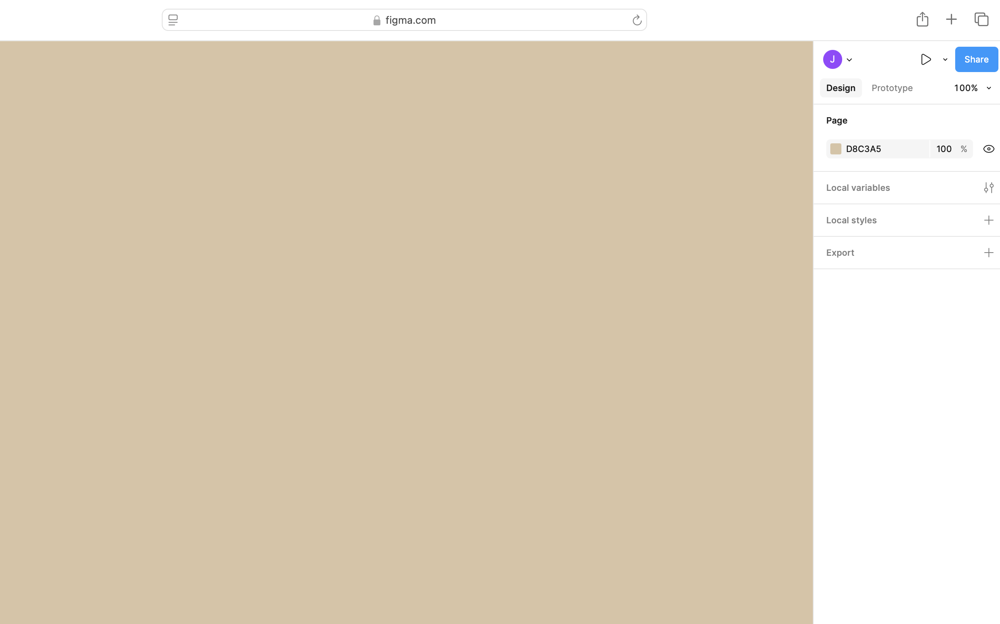

### Download the Assets
If you haven’t already, go ahead and [download the resources](https://uviclibraries.github.io/figma-intro/resources/figma-intro-resources.zip) we’ll be using in this workshop. It includes icons and images to help us build our prototype. Once it’s downloaded, just unzip the file to access everything. Feel free to use your own images too if you want to add a personal touch to your design.

### Section Preview  

Before you begin, take a look at the **final result** you’ll be working towards in this section:  

  

---

# Create a design file

## 1. Creating a New Figma Design File  

1. Open **Figma** in your web browser [using this link](https://www.figma.com) or launch the **Figma Desktop App**.  
2. Log in with your Figma account. If you don’t have one, create a free account.  
3. On the **Figma Home** screen, click on the **Create** button on the top right.  
4. Then in the dropdown that appears, select **Design File**.  
5. A blank Figma file will open in a new tab.  
6. Right now, your file doesn’t have a name. Click on **"Untitled"** in the top left corner, type **"Figma Intro Workshop"**, and press **Enter** to save this as the filename.

    <button onclick="toggle('gif1')">Show/Hide Animation</button>
    

    
    

    
## 2. Setting the Page Background Color  

By default, Figma has a near-white canvas background. Let’s change that.  

1. Ensure that **nothing is selected** on the canvas. Click on an empty space in the workspace.  
2. In the **Right Sidebar**, locate the **Page** section under **Design**.  
3. Click on the **color box** to open the color picker.  
4. Make sure **Hex** is selected in the dropdown menu.  
5. In the input field, type **#D8C3A5** and press **Enter** to apply the background color.
6. Your canvas background should now match the selected color.  

    <button onclick="toggle('gif2')">Show/Hide Animation</button>
    

    
    

    
### Next Steps  
In the next step, we will learn about **Frames** and how to structure our designs in Figma.  

[NEXT STEP: Working with Frames](desktop-frame.html)
