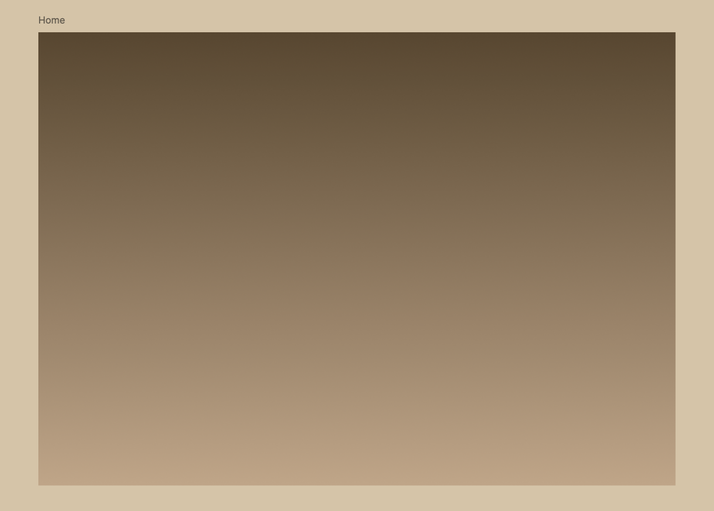
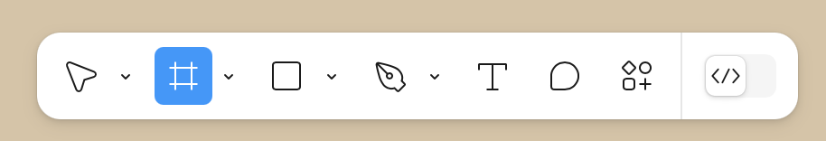
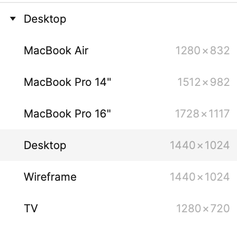
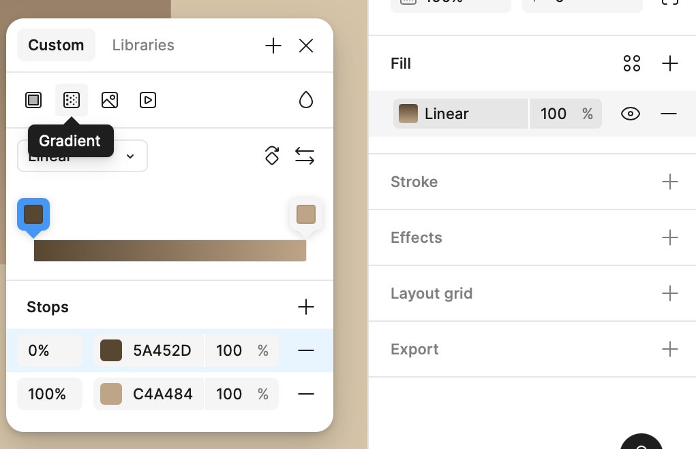

### Section Preview

Before you begin, take a look at the **final result** you’ll be working towards in this section. We are setting the stage for our design.

---

# Working with Frames

In Figma, we don't use "Artboards" or "Pages" in the traditional sense. We use **Frames**. A Frame is a smart container that knows how to adapt to different screen sizes.

## 1. Creating the Canvas

1.  **The Shortcut:** Press **F** on your keyboard (or click the grid icon in the top left).
    

2.  **Select Size:** On the **Right Sidebar**, you will see a list of device presets. Click **Desktop** > **Desktop** (1440 x 1024).
    * *Why this size?* It is the industry standard for designing web layouts.
    

3.  **Verify:** Your new white frame will appear on the canvas.

    <button onclick="toggle('gif1')">Show/Hide Animation</button>
    

    
    

## 2. Organization (Renaming Layers)

Figma files get messy fast. Professional designers rename their layers immediately.

1.  Look at the **Layers Panel** on the left sidebar.
2.  Double-click on the default name **"Desktop - 1"**.
3.  Rename it to **"Home"**.

    <button onclick="toggle('gif2')">Show/Hide Animation</button>
    

    
    

## 3. Applying the Gradient Background

We want a premium look, not a flat color. We will use a **Linear Gradient**.

1.  Select your **"Home"** Frame.
2.  **Open the Color Picker:** In the **Right Sidebar**, look for the **Fill** section and click the color square.
3.  **Switch to Gradient:** At the top of the color window, click the **Gradient Icon** (it looks like a square fading out).
    

4.  **Set the Colors (Stops):**
    A gradient is made of two "Stops" (the squares on the line).
    * **Top Stop (Start):** Click the left square on the line. Paste this Hex code: **`#5A452D`** (Dark Brown).
    * **Bottom Stop (End):** Click the right square on the line. Paste this Hex code: **`#C4A484`** (Light Beige).

    <button onclick="toggle('gif3')">Show/Hide Animation</button>
   

    
    

### Next Steps
Now that our canvas is ready, we need to build the navigation.

[NEXT STEP: Building the Header](building-header.html)
