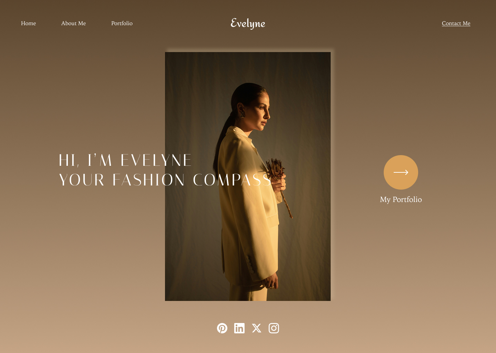
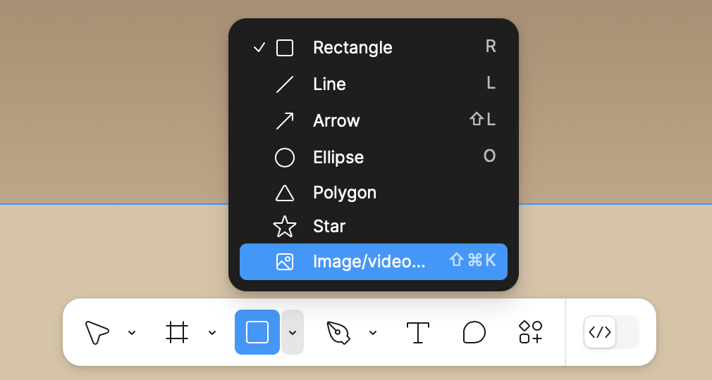
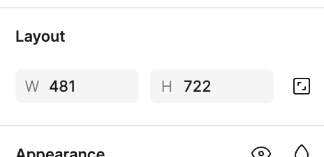
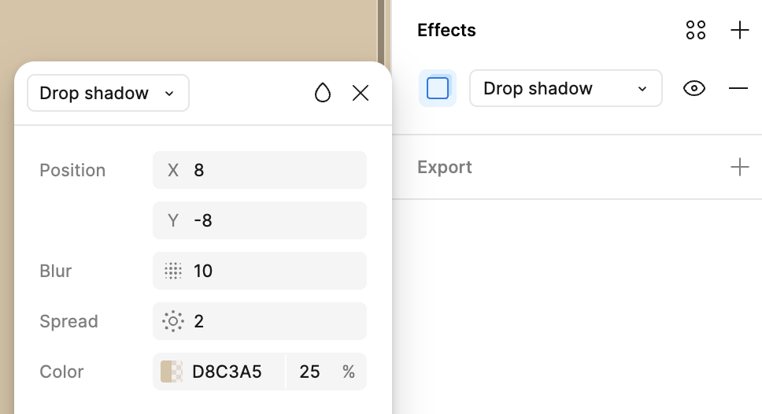
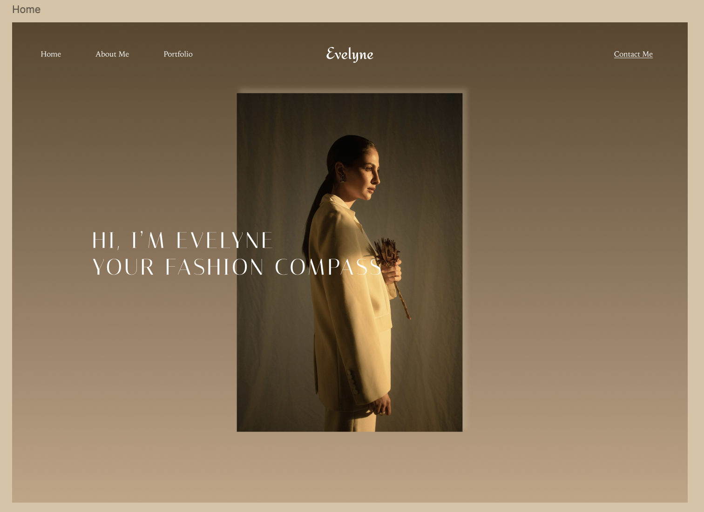
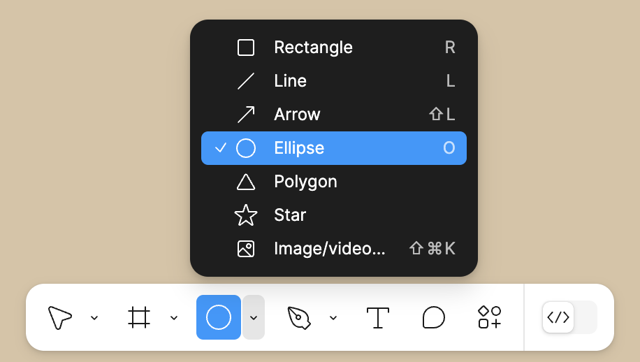
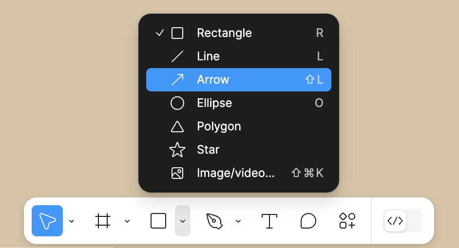

### Section Preview  

Before you begin, take a look at the **final result** you’ll be working towards in this section:  

  

---

# Adding the Center Image  

To begin designing the **home page**, we will start by adding the main image. All the icons and images required are already provided in the assets you downloaded in step 2 of the **Pre-Workshop Activities**

## Adding an Image to the Home Frame  

1. Ensure the **Home Frame** is selected in the **Layers Panel**.  
2. Click on the shape icon (as seen below) in the **bottom toolbar**.  
3. From the dropdown menu, select **"Image/video"**.  

4. In the file selection window, choose the **image** titled **woman-holding-flower**
5. Move your cursor over the **Home Frame** and **click once** to place the image inside the frame.  
6. With the image selected, go to the **Right Sidebar** and set the dimensions under Layout:  
   - **Width:** 481  
   - **Height:** 722<br> 

7. If the image seems to disappear, but if you zoom out, you may find it near the top left of your Figma file. Manually drag it back to center it within the Home frame.

## Adding a Drop Shadow  

Now, let's add a subtle **drop shadow** effect to enhance the image.  

1. With the image still selected, go to the **Right Sidebar** and scroll to the **Effects** section.  
2. Click the **+** icon to add a new **Drop Shadow**.  
3. Open the Effect Settings by clicking on the square icon to the left of the "Drop Shadow"
4. Adjust the settings as follows:  
   - **Position:** X = 8, Y = -8  
   - **Blur:** 10  
   - **Spread:** 2  
   - **Color:** **#D8C3A5** with **25% opacity**<br>



## Adding the Headline Text  

Now, we will add the main **headline text** to the home page and style it to match the design.  

### Adding the Text  

1. Ensure the **Home Frame** is selected in the **Layers Panel**.  
2. Press **T** to activate the **Text Tool**, or click on the **Text** icon in the bottom toolbar.  
3. Click inside the **Home Frame** and type the following text:  

```
HI, I’M EVELYNE
YOUR FASHION COMPASS
```

4. In the **Layers Panel**, select the newly created text layer.  

### Styling the Text  

With the text selected, go to the **Right Sidebar** under **Typography** and set:  
- **Font Family:** Italiana  
- **Font Size:** 48  
- **Font Weight:** Regular  
- **Letter Spacing:** 10%  
- **Text Color:** White (#FFFFFF)  
- **Text Case:** Uppercase  

### Aligning the Text  

1. Click and **drag the text** towards the left side of the **Home Frame** while observing the **red alignment guides**.  
2. Position it so that it is **aligned horizontally with the center of the image** but slightly offset to the left.  
3. Adjust the vertical positioning if needed to create a **balanced layout**.  



### Adding the Portfolio Button  

Now, let’s create the **"My Portfolio"** button with an arrow icon.  

#### Creating the Button Shape  

1. Ensure the **Home Frame** is selected.  
2. Press **O** to activate the **Ellipse Tool**, or click on the **Ellipse** icon from the bottom toolbar.  

3. Click and **drag** to create a perfect circle.  
4. In the **Right Sidebar**, set the **exact dimensions**:  
- **Width:** 100  
- **Height:** 100  
5. In the **Fill** section, change the color to **#D9A159** (a warm gold tone).  

#### Adding the Arrow Icon  

1. Press **Shift + L** to activate the **Arrow Tool**, or click on the **Arrow** icon from the bottom toolbar.  

 
2. In the **Right Sidebar**, set the **exact dimensions**:  
- **Width:** 41  
- **Height:** 0 
3. Change the arrow color to **White (#FFFFFF)**.  
4. Position the arrow in the **center** of the circle using the **alignment guides**.  

#### Adding the Button Label  

1. Press **T** to create a new text layer below the button.  
2. Type **"My Portfolio"**.  
3. In the **Right Sidebar**, adjust the text properties:  
- **Font Family:** Iowan Old Style  
- **Font Size:** 22  
- **Font Weight:** Roman  
- **Text Color:** White (#FFFFFF)  
- **Text Alignment:** Center  
4. Drag the text **below the button**, ensuring it's properly aligned using the **red guidelines**.  

#### Grouping and Positioning  

1. Select the **circle, arrow, and text** together.  
2. **Right-click** and select **Group Selection** to keep them as one unit.  
3. Drag the button group to the **right side** of the **Home Frame**, ensuring balanced spacing from the image.  
  
#### Creating the Auto Layout for Social Icons  

All the social media icons required are already provided in the assets you downloaded in step 2 of the **Pre-Workshop Activities**.  

1. Pick four icons that you would like to use. We'll go with **Pinterest, LinkedIn, Twitter (X), and Instagram**.  
2. Add the image of each icon onto the **Home Frame**, just like you added the image earlier.  
3. Set the **dimensions** of each icon to a **width and height of 30px**.  
4. In the **Layers Panel**, select all the social media icons you added and use the shortcut **Shift + A** to create an **Auto Layout**.  
5. Adjust the **horizontal spacing between icons** to **20px**.  
6. Align the **Auto Layout** at the **bottom center** of the **Home Frame**, ensuring a balanced design with proper spacing from other elements.  

Now that the home page is complete, the next step is designing the **Portfolio Page**, where Evelyne showcases her work in a visually appealing layout.

<script>  

    function toggle(input) {
        var x = document.getElementById(input);
        if (x.style.display === "none") {
            x.style.display = "block";
        } else {
            x.style.display = "none";
        }
    }
</script>


[NEXT STEP: Designing the Portfolio Page](portfolio-page.html){: .btn .btn-blue }  
