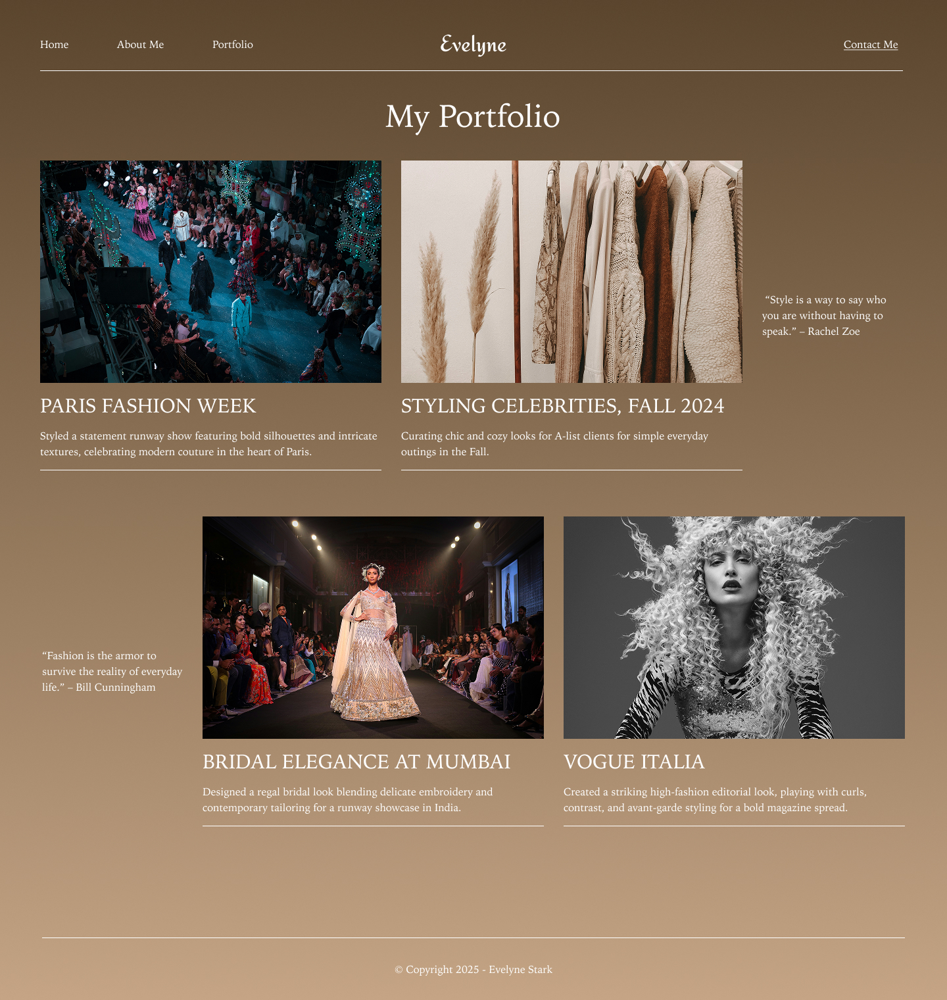

### Section Preview  

Before you begin, take a look at the **final result** you’ll be working towards in this section:  

TODO
  

---

# Adding the Center Image  

To begin designing the **home page**, we will start by adding the main image.  

## 1. Downloading the Image  

- [Download the Image](#) *(TODO Replace with actual download link)*  
- To ensure consistency in design, use the provided image or select one that fits the theme. The image should be **high-quality and vertically oriented**. Make sure it aligns with the dimensions specified in this section.  


## 2. Adding an Image to the Home Frame  

Instead of setting an image as a fill, we will **place it directly into the Home Frame** as an independent layer.  

1. Ensure the **Home Frame** is selected in the **Layers Panel**.  
2. Click on the **"Insert" button** (the plus **➕** icon) in the **top toolbar**.  
3. From the dropdown menu, select **"Image"**.  
4. In the file selection window, choose the **image file** you downloaded earlier and click **Open**.  
5. Move your cursor over the **Home Frame** and **click once** to place the image inside the frame.  
6. With the image selected, go to the **Right Sidebar** and set the exact dimensions:  
   - **Width:** 481  
   - **Height:** 722  
7. Align the image properly by using the alignment tools:  
   - Click **Align Horizontal Center** to center it within the Home Frame.  
   - Manually adjust the vertical position to ensure it sits balanced on the page.  


## 3. Adding a Drop Shadow  

Now, let's add a subtle **drop shadow** effect to enhance the image.  

1. With the image still selected, go to the **Right Sidebar** and scroll to the **Effects** section.  
2. Click the **+** icon and select **Drop Shadow** from the dropdown.  
3. Adjust the settings as follows:  
   - **Position:** X = 8, Y = -8  
   - **Blur:** 10  
   - **Spread:** 2  
   - **Color:** **#D8C3A5** with **25% opacity**


## 4. Adding the Headline Text  

Now, we will add the main **headline text** to the home page and style it to match the design.  

### Adding the Text  

1. Ensure the **Home Frame** is selected in the **Layers Panel**.  
2. Press **T** to activate the **Text Tool**, or click on the **Text** icon in the top toolbar.  
3. Click inside the **Home Frame** and type the following text:  

```
HI, I’M EVELYNE
YOUR FASHION COMPASS
```

4. In the **Layers Panel**, select the newly created text layer.  

### Styling the Text  

1. With the text selected, go to the **Right Sidebar** under **Typography** and set:  
- **Font Family:** Italiana  
- **Font Size:** 48  
- **Font Weight:** Regular  
- **Letter Spacing:** 10%  
- **Text Color:** White (#FFFFFF)  
- **Text Case:** Uppercase  

### Aligning the Text  

1. Click and **drag the text** towards the left side of the **Home Frame** while observing the **red alignment guides**.  
2. Position it so that it is **aligned horizontally with the center of the image** but slightly offset to the left.  
3. Adjust the vertical positioning if needed to create a **balanced layout**.  


### Adding the Portfolio Button  

Now, let’s create the **"My Portfolio"** button with an arrow icon.  

#### Creating the Button Shape  

1. Ensure the **Home Frame** is selected.  
2. Press **O** to activate the **Ellipse Tool**, or click on the **Circle** icon from the top toolbar.  
3. Click and **drag** to create a perfect circle.  
4. In the **Right Sidebar**, set the **exact dimensions**:  
- **Width:** 80  
- **Height:** 80  
5. In the **Fill** section, change the color to **#D8A25A** (a warm gold tone).  

#### Adding the Arrow Icon  

1. Click on the **Insert** button (➕) in the top toolbar and select **"Icon"** from the menu.  
2. In the search bar, type **"Arrow Right"** and select a simple right-facing arrow.  
3. Resize the arrow so it fits neatly inside the circle.  
4. Change the arrow color to **White (#FFFFFF)**.  
5. Position the arrow in the **center** of the circle using the **alignment guides**.  

#### Adding the Button Label  

1. Press **T** to create a new text layer below the button.  
2. Type **"My Portfolio"**.  
3. In the **Right Sidebar**, adjust the text properties:  
- **Font Family:** Iowan Old Style  
- **Font Size:** 16  
- **Font Weight:** Regular  
- **Text Color:** White (#FFFFFF)  
- **Text Alignment:** Center  
4. Drag the text **below the button**, ensuring it's properly aligned using the **red guides**.  

#### Grouping and Positioning  

1. Select the **circle, arrow, and text** together.  
2. **Right-click** and select **Group Selection** to keep them as one unit.  
3. Drag the button group to the **right side** of the **Home Frame**, ensuring balanced spacing from the image.  

Now that the home page is complete, the next step is designing the **Portfolio Page**, where Evelyne showcases her work in a visually appealing layout.  

[NEXT STEP: Designing the Portfolio Page](portfolio-page.html){: .btn .btn-blue }  