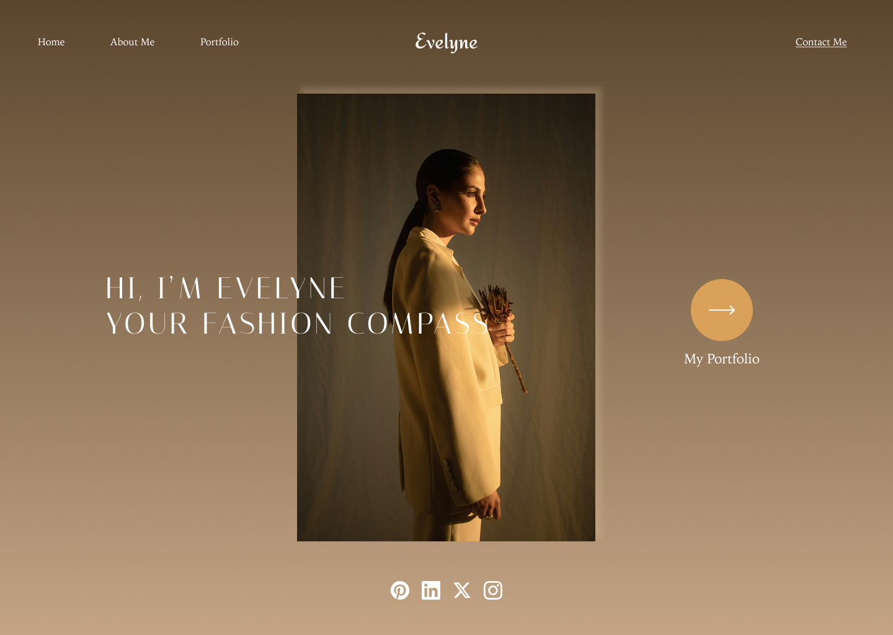

 

# Build a Website UI with Figma

- **Pre-workshop activities**
- **Introductory presentation**
- **Hands-on activities**

## What is Figma?

[Figma](https://www.figma.com) is a cloud-based design tool that allows you to create **user interfaces (UI)** for websites, apps, and digital products. It's popular among web designers because of its collaborative features, ease of use, and flexibility for creating responsive designs.

Even if you've never used a design tool before, Figma's **beginner-friendly** interface will help you quickly get started on your first website project. 

## What Are We Building?  

In this workshop, we are designing a **portfolio website for a fictional fashion designer**. Through this project, you’ll learn how to create a visually stunning and interactive UI that showcases a designer’s work in an elegant and professional layout.  

By the end of this workshop, you will have built a **fully designed and interactive website UI** in Figma. Below is the final design you will work towards:    

### **Home Page**  
  

### **Portfolio Page**  
  

### **About Me Page**  
  

## Learning Objectives

This workshop is designed for beginners interested in learning **UI design principles** and how to use Figma to create a **basic website layout**.

By the end of this workshop, you will:

- Understand the basic tools and features in **Figma**  
- Create a simple **website layout** using **frames, grids, and components** 
- Apply **typography, colors, and images** to your design  
- Build an **interactive prototype** of your website  
- Share your design with others for feedback and handoff
 
[NEXT STEP: Pre-Workshop Activities](pre-workshop.html){: .btn .btn-blue }
