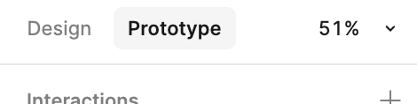
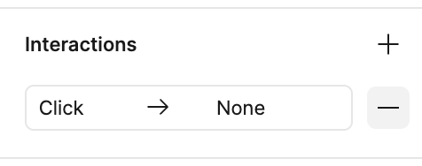
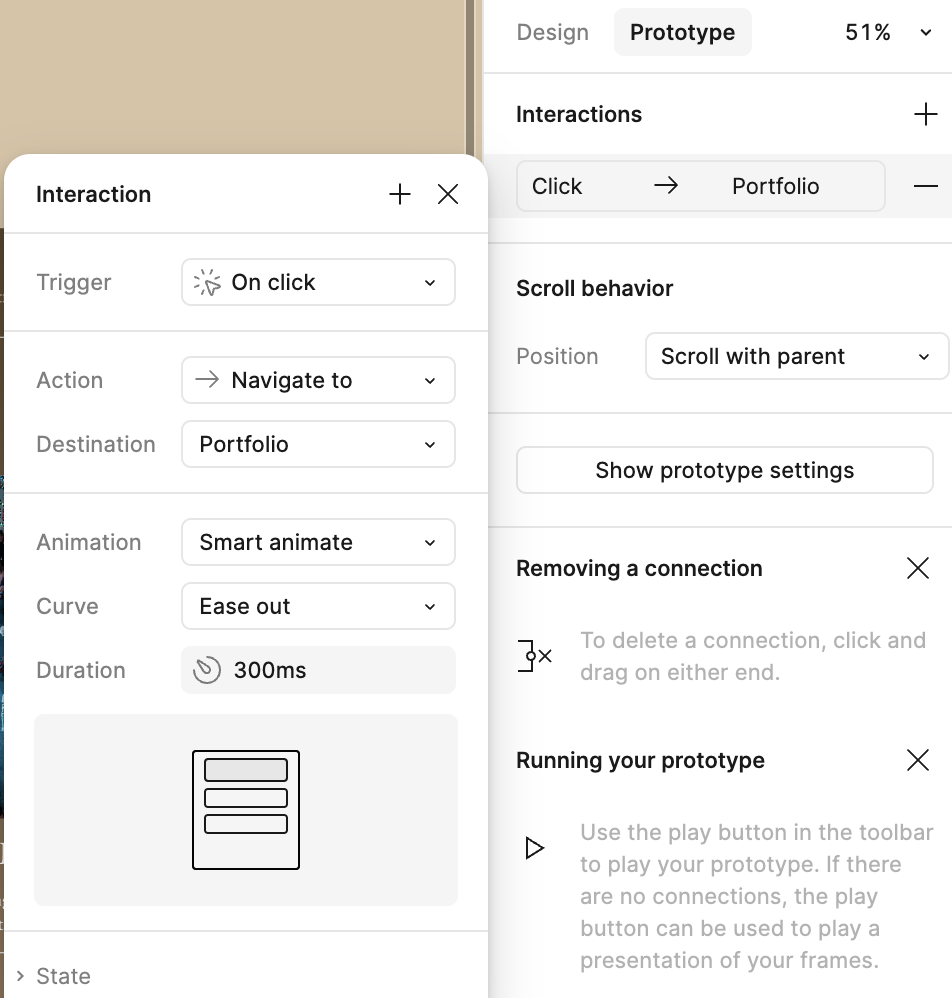

# Linking Pages with Smart Animate  

Linking pages in Figma allows you to create a **clickable prototype** that simulates user flow, helping you visualize and test your design before final development. Adding **Smart Animate** transitions enhances this experience by animating elements between frames, giving your prototype a polished, professional feel.  

## 1. Linking the "Portfolio” in header 

1. In the **Layers Panel**, find and select the **Home Frame**.  
2. Switch to **Prototype Mode** by clicking the **Prototype** tab in top of the right sidebar.  

3. On the **Home Frame**, locate the **Portfolio** text in your header navigation.  
4. Now head over to the right sidebar, under "Interactions", click the minus button beside the current "Click" interaction. This removes it so we can add a new one ourselves  

5. Now click the plus button, and on the panel that appears, select the following options:  
   - **Trigger**: On Click  
   - **Action**: Navigate To  
   - **Destination**: Portfolio  
   - **Animation**: Smart animate  
   - **Curve**: Ease out 
   - **Duration**: 300ms 
  

## 2. Linking the "My Portfolio" button  

1. Still on the **Home Frame**, select the **"My Portfolio"** button.  
2. Now repeat the steps in the earlier section to add a **Smart animate** interaction

## 3. Creating a Link Back to the Home Page  

1. Switch to the **Portfolio Frame** in the **Layers Panel**.  
2. Now repeat the steps in the earlier section to add a **Smart animate** interaction. Here, the Destination should now be the Home Frame instead of Portfolio since we want to be taken to the Home frame whenever we click this

## 4. Testing Your Prototype  

1. Click the **Present** button (▶) in the top-right corner of Figma.  
2. Navigate through the links by clicking on the buttons we just added prototype behaviors to.  
3. Observe the **Smart Animate** transitions and confirm the navigation flow feels smooth.  

> **Note:** When you launch the prototype, it will open in a new window. You might need to resize it to fit your full screen for the best viewing experience — or click the **fullscreen icon** in the top-right corner of the prototype window.

Now that your pages are linked with smooth **Smart Animate transitions**, the next step is designing the **About Me Page**, where we will introduce Evelyne with structured sections and interactive elements.  

[NEXT STEP: Designing the About Me Page](about-page.html){: .btn .btn-blue }  
