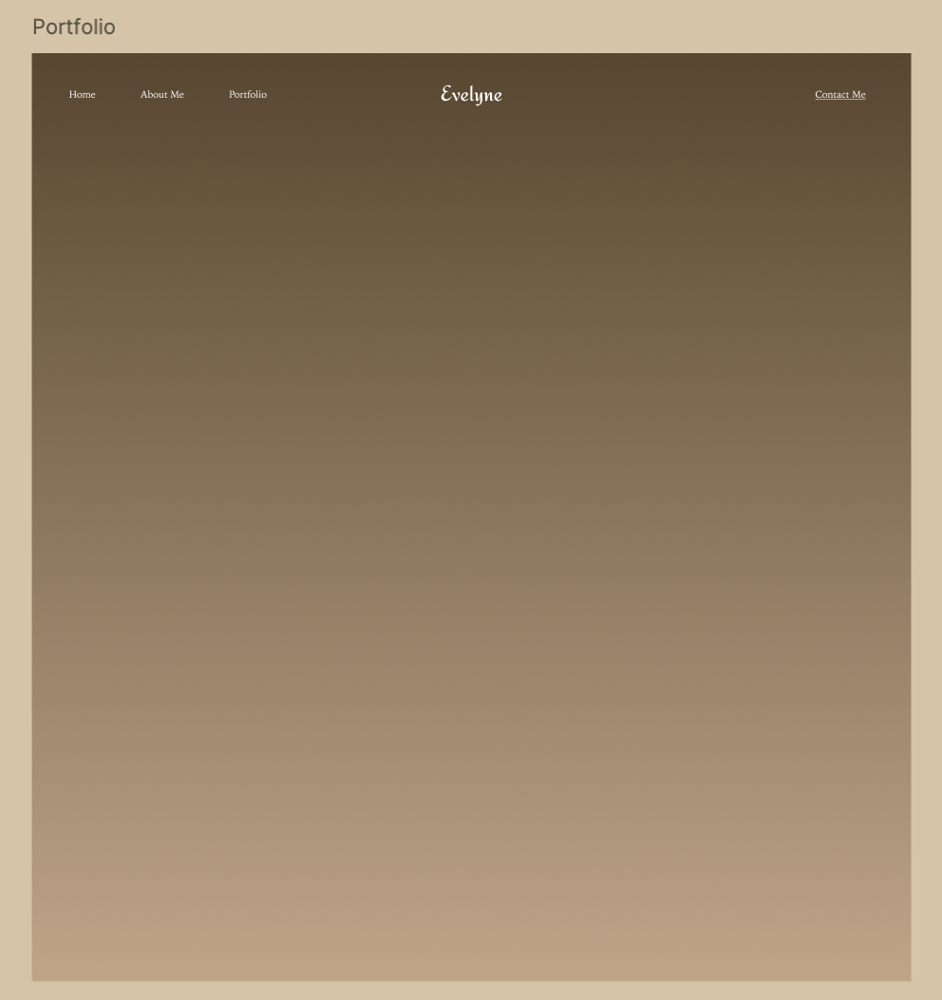
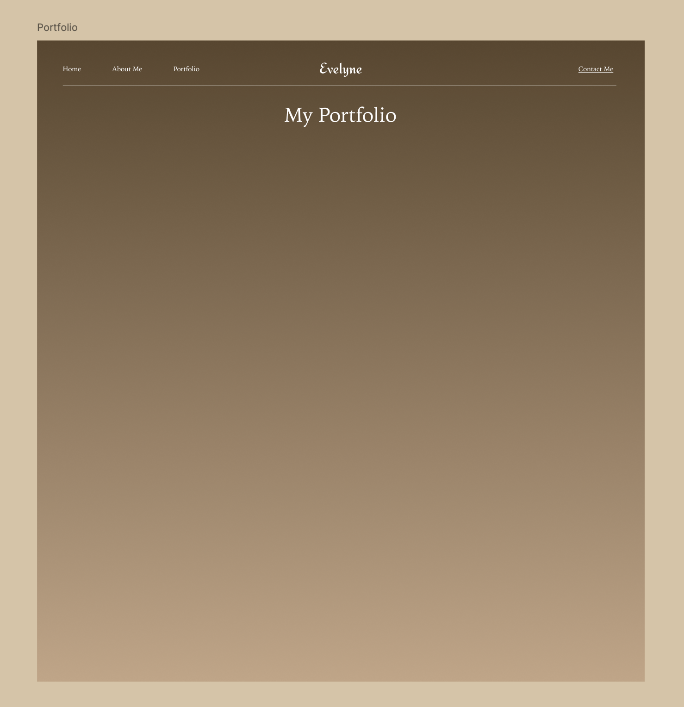
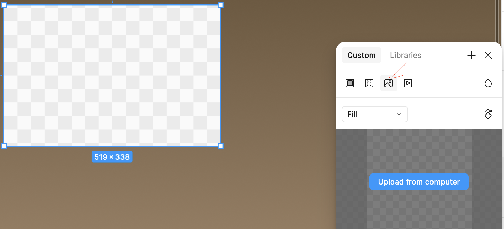
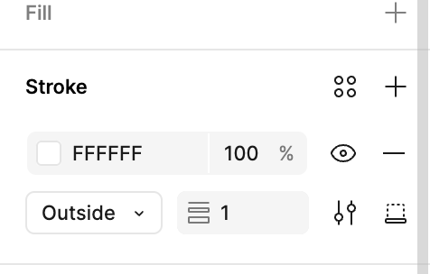
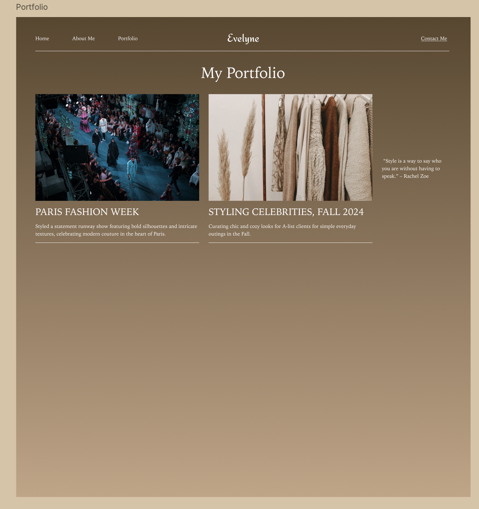
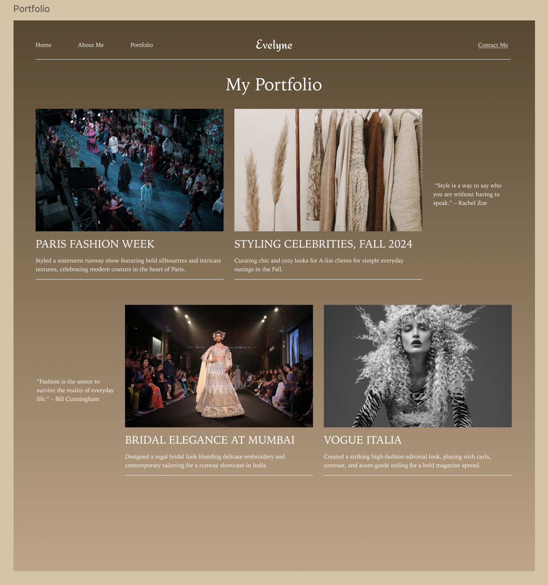
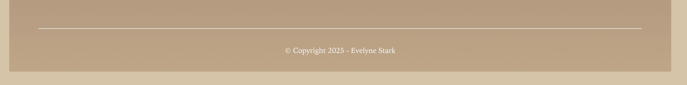

### Section Preview

Before you begin, take a look at the **final result** you’ll be working towards in this section. We are going to build this using **Components**—a powerful feature that lets you manage multiple projects easily.


---

# Setting Up the Portfolio Page

The **Portfolio Page** showcases featured projects. To begin, we will duplicate the **Home Page** to keep our header consistent.

## Create the Portfolio Page Frame
1. In the layers panel, select the **Home** frame.
2. Duplicate it using **Command + D** (Mac) or **Ctrl + D** (Windows).
3. Clear all content inside *except* the **Header**.
4. Rename the frame to **"Portfolio"**.
5. On the **Right Sidebar**, increase the height of the frame to **1520**.


## Adding a Divider Line

To separate the navigation from the portfolio content, we will add a **thin white line**.

1. Select the **Portfolio Frame**.
2. Press **L** (Line Tool).
3. Draw a horizontal line under the header.
4. In the **Right Sidebar**, adjust properties:
    - **Color:** White (#FFFFFF)
    - **Stroke Weight:** 1px
    - **Length:** Match the width of your navigation.

    <button onclick="toggle('gif1')">Show/Hide Animation</button>
    <div id="gif1" style="display:none;">
    
    </div>

## Grouping the Header and Divider

To keep the header and line aligned, we use **Auto Layout**.

1. Select both the **Header Group** and the **White Line**.
2. **Right-click** > **Add Auto Layout** (or Shift + A).
3. In the **Right Sidebar**, set **Vertical Spacing** to **21**.

    <button onclick="toggle('gif2')">Show/Hide Animation</button>
    <div id="gif2">
    
    </div>

## Adding the "My Portfolio" Title

1. Press **T** (Text Tool).
2. Click inside the frame and type: **"My Portfolio"**.
3. **Style:**
    - **Font:** Noto Serif JP
    - **Size:** 48, **Weight:** Regular
    - **Color:** White (#FFFFFF)
    - **Align:** Center
4. Center the title below the divider.


---

# Creating the "Master Card" (Components)

Instead of drawing rectangles 4 times, we will create one **Master Component**.

### Creating the Card Structure

1. Press **F** (Frame Tool) or **R** (Rectangle) to create the container.
2. Draw a shape: **Width 519**, **Height 338**.
3. **Fill:** Click the color box > select **Image** > choose "people-fashion-show".


4. Press **T** and add the **Title** below the image:
    - **Text:** "PARIS FASHION WEEK"
    - **Style:** Noto Serif JP, Size 20, Uppercase, White.
5. Add the **Description** below that:
    ```
    Styled a statement runway show featuring bold silhouettes and intricate textures.
    ```
    - **Style:** Noto Serif JP, Size 16, Regular, White.

6. **Group & Layout:**
    - Select the Image, Title, and Description.
    - Press **Shift + A** (Auto Layout).
    - Set vertical spacing to **16**.

7. **Add Border:** Select the whole card, go to **Stroke**, and add a **Bottom Border** (White, 1px).


### Turn it into a Component
**Crucial Step:** With your card selected, click the **Create Component** icon (❖) at the top of the screen. The border will turn purple. This is now your Master.

---

# Building the Grid (Using Instances)

Now we will duplicate the Master Component to create our grid.

## Row 1: The "Right Quote" Layout

1. **Duplicate:** Select your Master Component and press **Cmd/Ctrl + D**. Drag the copy (Instance) to the side.
2. **Override Content:** In the new copy, change the content:
    - **Title:** Styling Celebrities, Fall 2024
    - **Image:** Click the image fill and swap to "hanging-brown-clothes".
    - **Description:** "Curating chic and cozy looks for A-list clients."

3. **Add Quote:**
    - Press **T** and type:
    ```
    “Style is a way to say who you are without having to speak.” – Rachel Zoe
    ```
    - **Style:** Width 214, Noto Serif JP, Size 16, White.

4. **Layout:** Select the two cards and the quote. Press **Shift + A** (Auto Layout). Set spacing to **30**.


## Row 2: The "Left Quote" Layout

1. Select the entire **Row 1** you just made.
2. **Duplicate** it and move it down.
3. **Swap Positions:** Select the Quote text in the new row and press the **Left Arrow Key** on your keyboard until it moves to the start.
4. **Update Content:**
    - **Quote:** Change to the "Bill Cunningham" quote.
    - **Images & Titles:** Update them for "Bridal Elegance" and "Vogue Italia".



---

# Creating the Footer

To finish, we add a simple copyright.

1. **Line:** Draw a horizontal line (**L**) at the bottom (White, 1px).
2. **Text:** Press **T** and type:
    ```
    © Copyright 2026 - Evelyne Stark
    ```
3. **Style:** Noto Serif JP, 16, Center, White.


---

Now that the **footer is complete**, the Portfolio Page is fully designed!

<script>
    function toggle(input) {
        var x = document.getElementById(input);
        if (x.style.display === "none") {
            x.style.display = "block";
        } else {
            x.style.display = "none";
        }
    }
</script>

[NEXT STEP: Adding Page Transition Animations](linking-across-pages.html)
