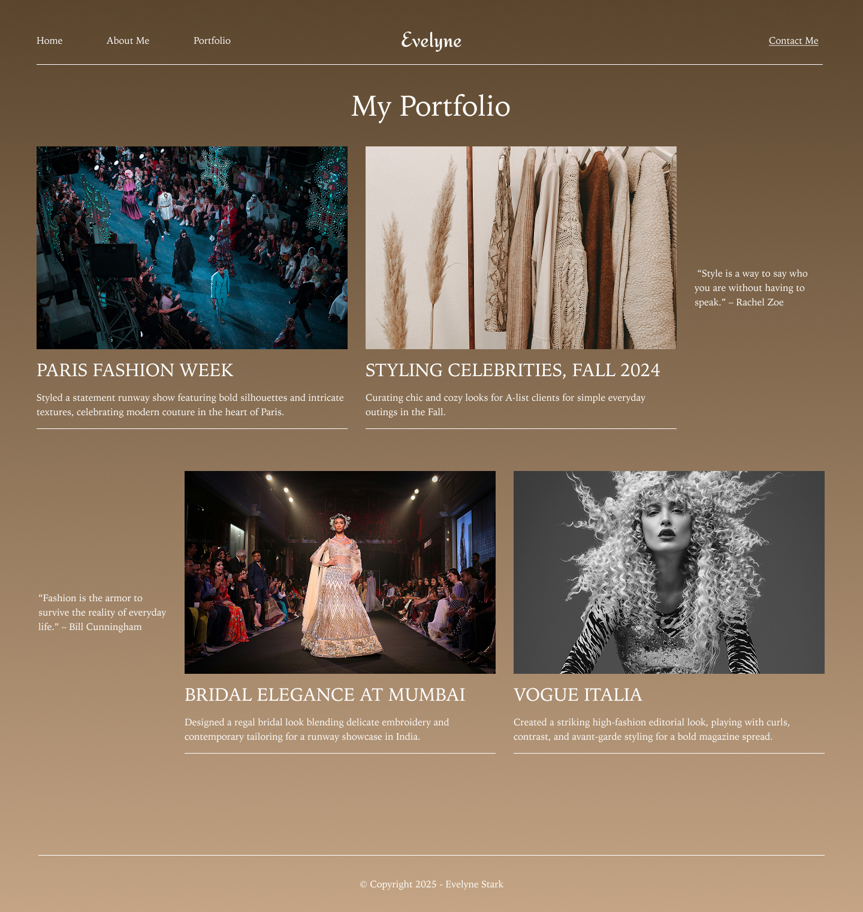

# Workshop Activities
This workshop is designed to be **mostly hands-on**. The “presentation” is capped at **15 minutes**. The rest is you building.

  

    <h3 style="margin-top:0;">Training Loop</h3>
    <ul>
      <li><strong>Demo (90s)</strong></li>
      <li><strong>Build (6–8m)</strong></li>
      <li><strong>Variation (2m)</strong></li>
      <li><strong>Checkpoint</strong></li>
    </ul>
  

  

    
  

## Workshop Format (how we run this)
We repeat a simple training loop:

1) **Demo**
2) **Build **
3) **Variation**: you change something intentionally  
4) **Checkpoint**: you prove it works (not “looks kind of ok”)

If you only copy exact values, you will leave with a fragile design and zero skill. Don’t do that.

## Schedule (90 minutes)
| Time | What happens | What you produce |
|---:|---|---|
| 0:00–0:05 | Welcome + setup check | Everyone has a file open |
| 0:05–0:20 | Intro (max 15 min) | You understand Frames, Layers, Auto Layout, Prototype |
| 0:20–0:25 | Scavenger Hunt | You can navigate Figma without panic |
| 0:25–0:45 | Home page build | Header + hero layout |
| 0:45–1:05 | Portfolio build | Cards + grid/spacing consistency |
| 1:05–1:20 | Prototype | Clickable nav + transitions |
| 1:20–1:30 | About Me challenge + share | 1 finished page + share link |

## Deliverables (what “done” means)
To pass the workshop, you must have:

- **3 pages/frames** (Home, Portfolio, About Me)
- **Header navigation** that is consistent across pages
- **At least 2 working prototype links** (Home → Portfolio, Portfolio → Home)
- A **share link** (view or prototype link)

## Rubric (quick evaluation)
**Pass**
- Layout is readable and aligned
- Spacing is consistent (not random)
- Prototype links work

**Strong pass**
- Layers are named cleanly (Header / Hero / Cards / Footer)
- Auto Layout used intentionally (not accidental)
- Typography hierarchy is obvious (headline > body)

## Getting help (without derailing the room)
When you’re stuck, type one word in chat:
- **ZOOM** (you’re lost on the canvas)
- **LAYERS** (you can’t select something)
- **AUTO** (Auto Layout is fighting you)
- **PROTOTYPE** (your links don’t work)

That’s it. We fix fast and move on.
